# Observability using Citrix ADM and Citrix ADC Observability Exporter in Citrix powered Service mesh

This guide provides a comprehensive example for:

i) Deploying the sample [Bookinfo](https://github.com/istio/istio/tree/master/samples/bookinfo) and [Httpbin](https://github.com/istio/istio/blob/master/samples/httpbin/httpbin.yaml) applications with Citrix ADC as North-South and East-West proxies in Istio service mesh.

ii) Using Citrix ADM service graph and Citrix ADC Observability Exporter as observability tools.

The objective of this example is to help in visualizing the request flow between different microservices using Citrix ADM and metrics on the Grafana dashboard through Citrix ADC Observability Exporter.

# Table of Contents

   [Prerequisites](#prerequisite)

   A. [Onboarding of ADM agent](#onboarding)

   B. [Deploying Citrix Observability Exporter](#deploying-coe)

   C. [Generating Certificate and Key for Bookinfo and Httpbin applications](#generating-certificate)

   D. [Deploying Citrix ADC as Ingress Gateway](#citrix-ingress-gateway)

   E. [Deploying Citrix ADC Sidecar Injector](#citrix-sidecar-injector)

   F. [Deploying Bookinfo and Httpbin](#deploying-bookinfo-httpbin)

   G. [Generate application traffic](#send-traffic)

   H. [Deploy Gateway for Prometheus and Grafana](#deploy-gateway-prom-grafana)

   I. [Visualize Service Graph in Citrix ADM](#servicegraph)

   J. [Clean Up the deployment](#cleanup)

   K. [Debugging](#debugging)

# <a name="prerequisite">Prerequisites</a>
 - Ensure that you have a Citrix ADM account. To use Citrix ADM, you must create a [Citrix Cloud account](https://docs.citrix.com/en-us/citrix-cloud/overview/signing-up-for-citrix-cloud/signing-up-for-citrix-cloud).

    To manage Citrix ADM with an Express account, see [Getting Started](https://docs.citrix.com/en-us/citrix-application-delivery-management-service/getting-started.html#install-an-agent-as-a-microservice).

 - Ensure that you have installed [Kubernetes](https://kubernetes.io/) version 1.19 or later.
 - Ensure that you have Citrix ADC VPX version 13.0–76.29 or later.
 - For deploying Citrix ADC VPX or MPX as an ingress gateway, you should establish the connectivity between Citrix ADC VPX or MPX and cluster nodes. This connectivity can be established by configuring routes on Citrix ADC as described in the [Static routing](https://github.com/citrix/citrix-k8s-ingress-controller/blob/master/docs/network/staticrouting.md) or by deploying [Citrix Node Controller](https://github.com/citrix/citrix-k8s-node-controller).
 - Ensure that you installed [Istio](https://istio.io) version 1.9.x or later on the Kubernetes cluster with [Prometheus](https://prometheus.io) and [Grafana](https://grafana.com). For information about installing Prometheus, see [Installation Quick Start](https://istio.io/latest/docs/ops/integrations/prometheus/#option-1-quick-start) and for Grafana, see [Quick Start](https://istio.io/latest/docs/ops/integrations/grafana/#option-1-quick-start).
 - Ensure that the ports, mentioned in the [Ports](https://docs.citrix.com/en-us/citrix-application-delivery-management-service/system-requirements.html#ports) document, are open.

## <a name="onboarding">A) Service Graph Onboarding</a>
You can deploy a Citrix ADM agent as a microservice in the Kubernetes cluster to view service graph in Citrix ADM. 

Follow below steps:

 1. Log on to Citrix ADM and navigate to `Networks > Agents`. The Agent page is displayed.

    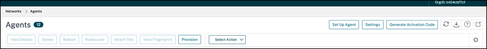

 2. Click `Setup up agent`.

 3. Click on `Get Started`.

    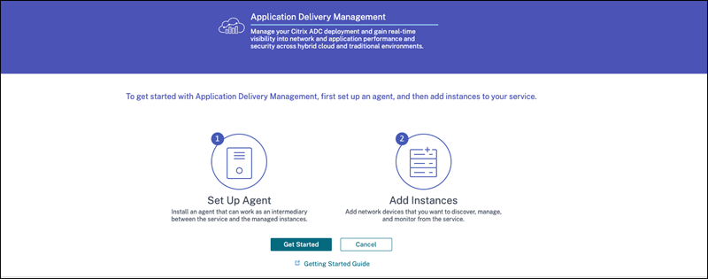

 4. Click on `Custom Deployment`

    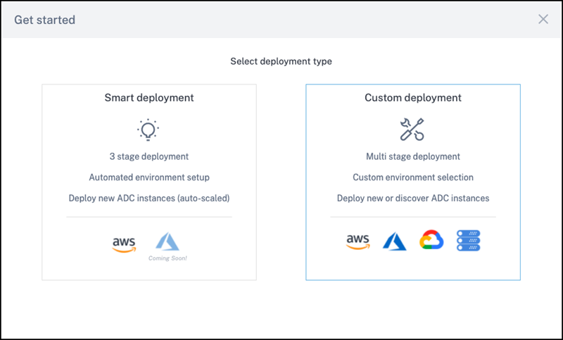

 5. Choose `On-Premises` and click `Next`.

    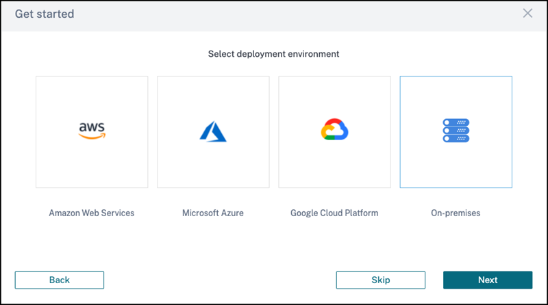

 6. Choose `Microservices` and click `Next`

    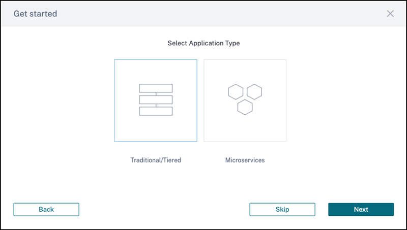

 7.  In the Download Agent Microservice page, specify the following parameters:

      a. **Application ID** : A string id to define the service for the agent in the Kubernetes cluster and distinguish         this agent from other agents in the same cluster. Use lowercase alphanumeric characters only. Uppercase characters are not supported.

      b. **Agent Password** – Specify a password for ADM agent. This passoword will be used on onboarding CPX to ADM service through the agent.

      c. **Confirm Password** – Specify the same password for confirmation.
       
      **Note**:You must not use the default password (nsroot).
    
      d. **Submit**

      **NOTE** You can save Application ID and Agent Password, this will be used while creating secret and updating variables in the YAML file. 

      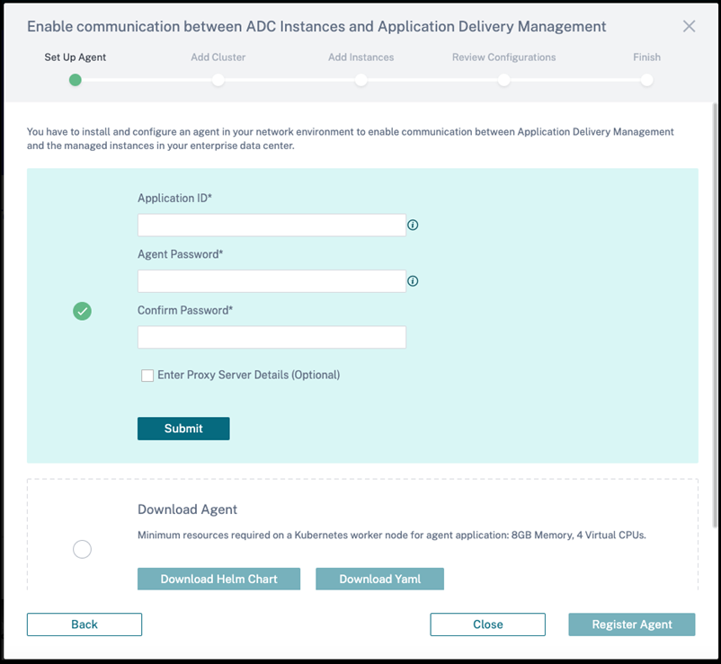

 8. After you click **Submit**, you can download the YAML or Helm Chart.

    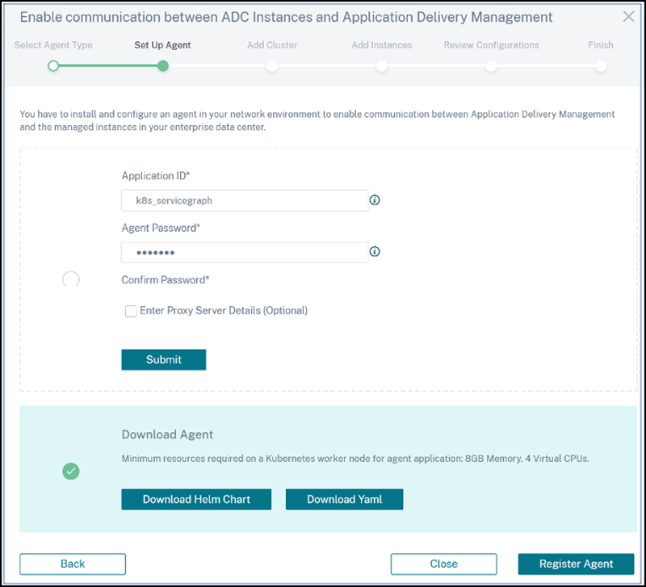

 9. In the Kubernetes main mode, save the downloaded YAML file and run the following command to register the agent:

         kubectl create -f < YAML file >
   
      For example, kubectl create -f testing.yaml
    
      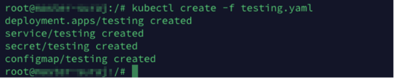 

      The agent is successfully created.

 10. Click **Register Agent**.
   
   
 
    The page loads for a few seconds and displays the registered agent.

 11. Ensure if the agent is present in the list and click **Next**.
  
   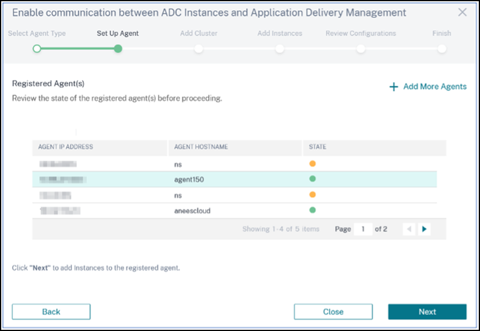

 12. You must register the cluster. Click Add More Clusters and specify the following parameters::

      a. **Name** - Specify a name of your choice.

      b. **API Server URL** - You can get the Kubernetes service IP in `default` namespace.

        kubectl get svc kubernetes -o wide

      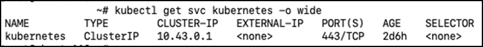

      Copy the cluster IP from the above output and provide in API Server URL as `https://<Cluster IP>:443`
        
      c. **Authentication Token** - Specify the authentication token. The authentication token is required to validate access for communication between Kubernetes cluster and Citrix ADM.

         To generate an authentication token; 
         
         On the Kubernetes master node:

       i. Use the following YAML to create a service account:
                
               apiVersion: v1
               kind: ServiceAccount
               metadata:
                   name: citrixadm-sa

       ii. Run `kubectl create -f <yaml file>`. The service account is created.

       iii. Run `kubectl create clusterrolebinding clusterBinding --clusterrole=cluster-admin --serviceaccount=default:citrixadm-sa` to bind the cluster role to service account.

            The service account now has the cluster-wide access. A token is automatically generated while creating the service account.

       iv. Run `kubectl describe sa citrixadm-sa` to view the token.

      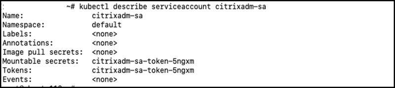

       v. To get the secret string, run `kubectl describe secret <token-name>`.

      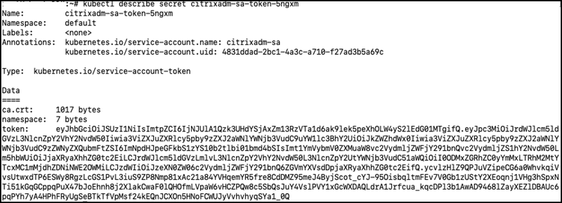

      d. Select the **agent** from the list.
    
      e. Click **Create**.

   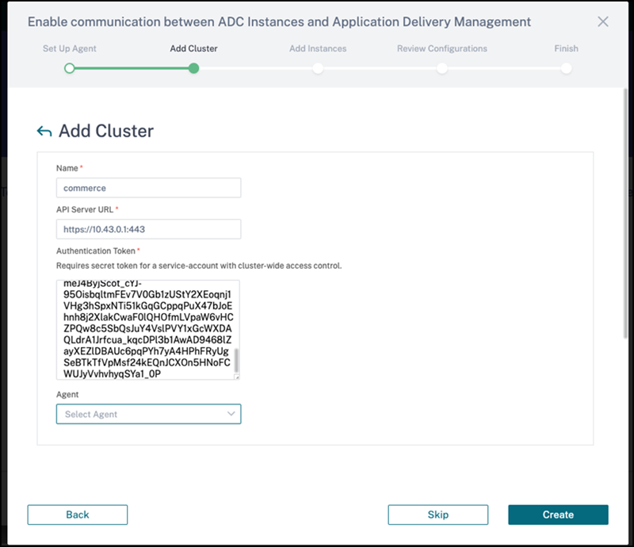

13. In the Clusters page, the cluster information is displayed. Click **Next**.

   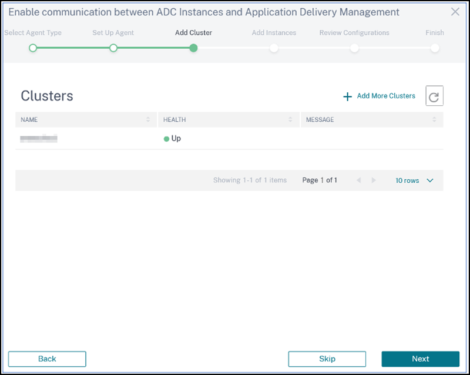

14. Configure the CPX and VPX instances, and click **Next**.

   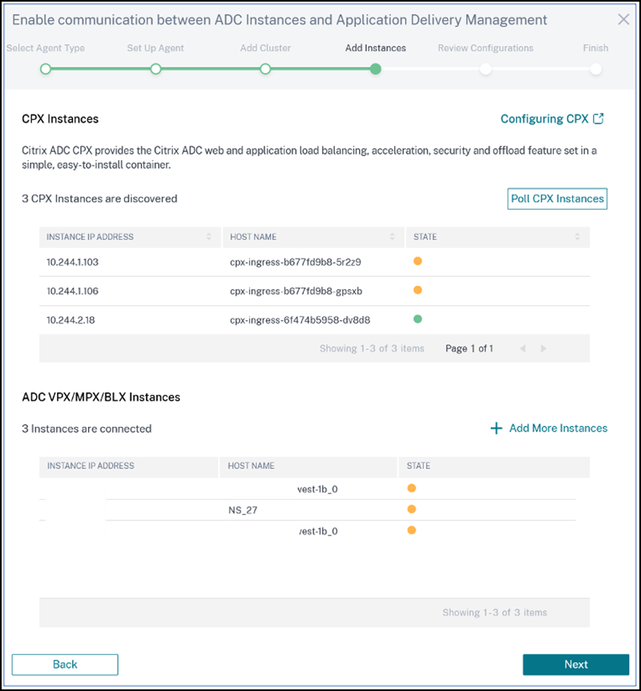

   **NOTE** You can deploy Citrix ADCs in Dual Tier topology as mentioned in [Citrix Cloud Native Dual Tier Topology ](#deploy-citrix-cloud-native-stack)   

15. Click **Next** to auto-license the virtual servers and to enable detailed web and TCP transactions.

   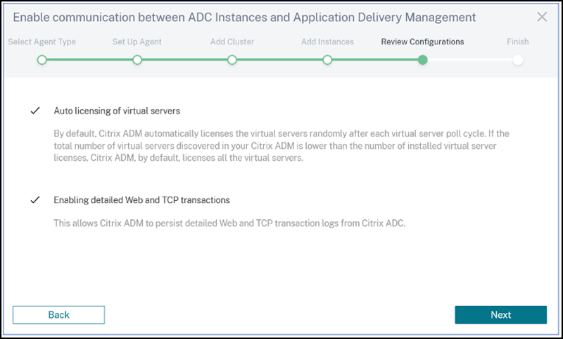

16. The configurations are complete. Select **Service Graph** and click **Done**.

   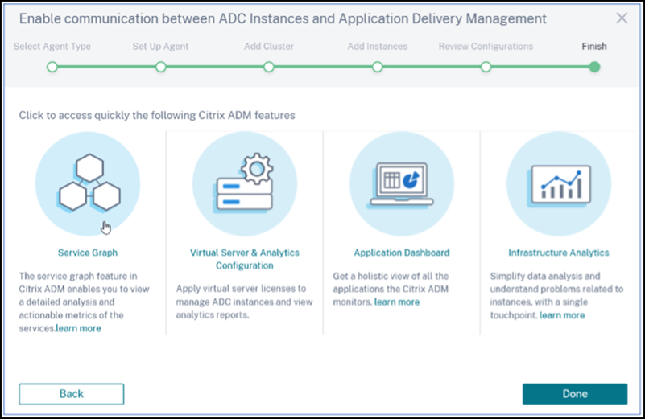

**NOTE**
  To auto register Citrix ADC CPX in ADM for obtaining [servicegraph](https://docs.citrix.com/en-us/citrix-application-delivery-management-service/application-analytics-and-management/service-graph.html), you will have to create a Kubernetes secret using ADM Agent credentials. Create a Kubernetes secret with password you have provided during `Step A.7.b` using the following command:

    kubectl create secret generic admlogin --from-literal=username=nsroot --from-literal=password=<adm-password>

# <a name="deploying-coe">B) Deploying Citrix ADC Observability Exporter</a>

Citrix ADC Observability Exporter helps in exporting metrics from Citrix ADC instances to Prometheus which can be visualized in the Grafana dashboard.

      helm repo add citrix https://citrix.github.io/citrix-helm-charts/
   
      helm install coe citrix/citrix-observability-exporter --namespace citrix-system --set timeseries.enabled=true

Apply destination rule to disable TLS communication of Citrix ADC with Citrix Observability Exporter and ADM by following command:

      kubectl apply -f https://raw.githubusercontent.com/citrix/citrix-helm-charts/master/examples/servicemesh_with_coe_and_adm/manifest/destinationrule_agent_coe.yaml -n citrix-system

**NOTE:** Create gateway for Citrix observability exporter when Citrix ADC CPX is used as ingress gateway.

      kubectl apply -f https://raw.githubusercontent.com/citrix/citrix-helm-charts/master/examples/servicemesh_with_coe_and_adm/manifest/coe_gateway.yaml -n citrix-system      

# <a name="generating-certificate">C) Generating Certificate and Key for the `Bookinfo` and `Httpbin` applications</a>

### C.1) Generate certificate and key for the `Bookinfo` application

There are multiple tools available to generate certificates and keys. You can use your desired tool to generate the same in PEM format. Make sure that the names of key and certificate are *bookinfo_key.pem* and *bookinfo_cert.pem*. These are used to generate a Kubernetes secret *citrix-ingressgateway-certs* which is used by the Citrix ADC that acts as Ingress Gateway.

Perform the following steps to generate certificate and key using `openssl` utility:

#### C.1.1) Generate private key for the `Bookinfo` application

      openssl genrsa -out bookinfo_key.pem 2048

#### C.1.2) Generate Certificate Signing Request for the `Bookinfo` application

Make sure to provide Common Name(CN/Server FQDN) as `www.bookinfo.com` on CSR information prompt.

      openssl req -new -key bookinfo_key.pem -out bookinfo_csr.pem

#### C.1.3) Generate Self-Signed Certificate for the `Bookinfo` application

      openssl x509 -req -in bookinfo_csr.pem -sha256 -days 365 -extensions v3_ca -signkey bookinfo_key.pem -CAcreateserial -out bookinfo_cert.pem

#### C.1.4) Create a Kubernetes secret for certificate of `Bookinfo` application

Create a secret `citrix-ingressgateway-certs` using the certificate and key generated in the earlier step. Make sure that this secret is created in the same namespace where the Ingress Gateway is deployed.

      kubectl create -n citrix-system secret tls citrix-ingressgateway-certs --key bookinfo_key.pem --cert bookinfo_cert.pem

### C.2) Generate certificate and key for `httpbin` application
 
 You can use your desired tool to generate the same in PEM format. Make sure names of key and certificate are *httpbin_key.pem* and *httpbin_cert.pem*. These are used to generate a Kubernetes secret *httpbin-ingressgateway-certs* which is used by the Citrix ADC taht acts as Ingress Gateway.

Perform the following steps to generate certificate and key using `openssl` utility:

#### C.2.1) Generate Private Key for the `httpbin` application

      openssl genrsa -out httpbin_key.pem 2048

#### C.2.2) Generate Certificate Signing Request for the `httpbin` application

Make sure to provide Common Name(CN/Server FQDN) as `www.httpbin.com` on CSR information prompt.

      openssl req -new -key httpbin_key.pem -out httpbin_csr.pem

#### C.2.3) Generate Self-Signed Certificate for the `httpbin` application

      openssl x509 -req -in httpbin_csr.pem -sha256 -days 365 -extensions v3_ca -signkey httpbin_key.pem -CAcreateserial -out httpbin_cert.pem

#### C.2.4) Create a Kubernetes secret for certificate of the `httpbin` application

Create a secret `httpbin-ingressgateway-certs` using the certificate and key generated in the earlier step. Make sure that this secret is created in the same namespace in which the Ingress Gateway is deployed.

      kubectl create -n citrix-system secret tls httpbin-ingressgateway-certs --key httpbin_key.pem --cert httpbin_cert.pem

# <a name="citrix-ingress-gateway">D) Deploying Citrix ADC as Ingress Gateway</a>

Before deploying Citrix ADC as Ingress Gateway and sidecar injector, get the pod IP address of the Citrix ADM Agent using the following command:

      kubectl get endpoints admagent

This ADM Agent pod IP address is required while creating the Ingress Gateway and sidecar injector.

### Deploy VPX/MPX as Ingress Gateway

You can deploy Citrix ADC CPX or VPX/MPX, as an ingress gateway using helm charts. The sample `bookinfo` deployment works in both of the deployments. 

- **Important Note:** For deploying Citrix ADC VPX or MPX as ingress gateway, you should establish the connectivity between Citrix ADC VPX or MPX and cluster nodes. This connectivity can be established by configuring routes on Citrix ADC as mentioned in the [Static Routing](https://github.com/citrix/citrix-k8s-ingress-controller/blob/master/docs/network/staticrouting.md) document or by deploying [Citrix Node Controller](https://github.com/citrix/citrix-k8s-node-controller).

Create a Kubernetes secret `nslogin` with the login credentials of Citrix ADC VPX/MPX using the following command:
   
      kubectl create secret generic nslogin --from-literal=username=<username> --from-literal=password=<password> -n citrix-system

**Note:** Replace `<username>` and `<password>` with login credentials of Citrix ADC VPX/MPX.

#### Deploying Citrix ADC VPX/MPX as Ingress Gateway using Helm Chart

      helm repo add citrix https://citrix.github.io/citrix-helm-charts/
   
      helm install citrix-adc-istio-ingress-gateway citrix/citrix-adc-istio-ingress-gateway --namespace citrix-system --set ingressGateway.EULA=YES --set citrixCPX=true  --set ADMSettings.ADMIP=X.X.X.X  --set coe.coeURL=coe.citrix-system --set ingressGateway.secretVolumes[0].name=httpbin-ingressgateway-certs,ingressGateway.secretVolumes[0].secretName=httpbin-ingressgateway-certs,ingressGateway.secretVolumes[0].mountPath=/etc/istio/httpbin-ingressgateway-certs  --set ingressGateway.tcpPort[0].name=tcp1,ingressGateway.tcpPort[0].nodePort=30900,ingressGateway.tcpPort[0].port=9090,ingressGateway.tcpPort[0].targetPort=9090 --set ingressGateway.tcpPort[1].name=tcp2,ingressGateway.tcpPort[1].nodePort=30300,ingressGateway.tcpPort[1].port=3000,ingressGateway.tcpPort[1].targetPort=3000>

**Note:** If Citrix ADC CPX is deployed as Ingress Gateway and `adm-agent-onboarding` job is deployed in other namespace than `citrix-system`, then label the namespace `citrix-system` with `citrix-cpx=enabled`.

      kubectl label namespace citrix-system citrix-cpx=enabled

#### Deploying Citrix ADC CPX

     helm install cpx-sidecar-injector citrix-cpx-istio-sidecar-injector --namespace citrix-system --set cpxProxy.EULA=YES --set xDSAdaptor.image=quay.io/ajeetas/xds-adaptor:0.9.8.latest  --set coe.coeURL=coe.citrix-system  --set ADMSettings.ADMIP=X.X.X.X

#### Set Analytics Settings on Citrix ADC VPX/MPX

Following configurations must be added in Citrix ADC VPX/MPX for sending transaction metrics to Citrix ADM.

      en ns mode ulfd
      
      en ns feature appflow
      
      add appflow collector logproxy_lstreamd -IPAddress <ADM-AGENT-POD-IP> -port 5557 -Transport logstream

      set appflow param -templateRefresh 3600 -httpUrl ENABLED -httpCookie ENABLED -httpReferer ENABLED -httpMethod ENABLED -httpHost ENABLED -httpUserAgent ENABLED -httpContentType ENABLED -httpAuthorization ENABLED -httpVia ENABLED -httpXForwardedFor ENABLED -httpLocation ENABLED -httpSetCookie ENABLED -httpSetCookie2 ENABLED -httpDomain ENABLED -httpQueryWithUrl ENABLED  metrics ENABLED -events ENABLED -auditlogs ENABLED
      
      add appflow action logproxy_lstreamd -collectors logproxy_lstreamd
      
      add appflow policy logproxy_policy true logproxy_lstreamd
      
      bind appflow global logproxy_policy 10 END -type REQ_DEFAULT 
      
      bind appflow global logproxy_policy 10 END -type OTHERTCP_REQ_DEFAULT

**Note:** Replace the `AGENT POD IP` while adding `appflow collector`. 

# <a name="citrix-sidecar-injector">E) Deploying Citrix ADC Sidecar Injector </a>

Deploy a Citrix ADC CPX sidecar injector to inject Citrix ADC CPX as a sidecar proxy in an application pod in the Istio service mesh by using the following command:

      helm repo add citrix https://citrix.github.io/citrix-helm-charts/

      helm install cpx-sidecar-injector citrix/citrix-cpx-istio-sidecar-injector --namespace citrix-system --set cpxProxy.EULA=YES --set coe.coeURL=coe.citrix-system  --set ADMSettings.ADMFingerPrint=abcd,ADMSettings.ADMIP=<ADM-AGENT-POD-IP>  

# <a name="deploying-bookinfo-httpbin">F) Deploying `Bookinfo` and `Httpbin`</a> 

In this example, the `bookinfo` and `httpbin` applications are deployed and exposed to the cluster-external world using the Istio Gateway resource. 
 
### G.1) Enable Namespace for Sidecar Injection
When a namespace is labelled with `cpx-injection=enabled`, CPX as sidecar proxy will be deployed along with application. As part of step A, both `bookinfo` and `httpbin` namespace are  labelled with `cpx-injection=enabled`. 

### F.2) Deploy the `Bookinfo` Application

      kubectl apply -n bookinfo -f https://raw.githubusercontent.com/citrix/citrix-helm-charts/master/examples/servicemesh_with_coe_and_adm/manifest/bookinfo.yaml  

### F.3) Deploy the `Httpbin` Application

      kubectl apply -n httpbin -f https://raw.githubusercontent.com/citrix/citrix-helm-charts/master/examples/servicemesh_with_coe_and_adm/manifest/httpbin.yaml

### F.4) Configure Ingress Gateway for `Bookinfo` and `Httpbin`

      kubectl apply -n bookinfo -f https://raw.githubusercontent.com/citrix/citrix-helm-charts/master/examples/citrix-adc-in-istio/bookinfo/deployment-yaml/bookinfo_https_gateway.yaml

      kubectl apply -n bookinfo -f https://raw.githubusercontent.com/citrix/citrix-helm-charts/master/examples/citrix-adc-in-istio/bookinfo/deployment-yaml/bookinfo_http_gateway.yaml

      kubectl apply -n httpbin -f https://raw.githubusercontent.com/citrix/citrix-helm-charts/master/examples/servicemesh_with_coe_and_adm/manifest/httpbin-secure-gateway.yaml

### F.5) Configure Virtual Service for `productpage` service for `bookinfo`

      kubectl apply -n bookinfo -f https://raw.githubusercontent.com/citrix/citrix-helm-charts/master/examples/citrix-adc-in-istio/bookinfo/deployment-yaml/productpage_vs.yaml

# <a name="send-traffic"> G) Generate application traffic</a>
   
  Send traffic using the helper script

      wget https://raw.githubusercontent.com/citrix/citrix-helm-charts/master/examples/servicemesh_with_coe_and_adm/manifest/traffic.sh

Provide VIP which has been used to expose the `bookinfo` and `httpbin` applications in `traffic.sh` and start traffic.

      nohup sh traffic.sh <VIP> > log &

To access from the browser, add the following entries on `/etc/hosts/`:
   
      VIP www.bookinfo.com
      
      VIP www.httpbin.com

Use the following instructions if you are running Linux/Unix/Mac:

1. Open a Terminal window.

2. Enter the following command to open the hosts file in a text editor:

      `sudo nano /etc/hosts`

3. Enter your domain user password.

4. Add below entries on the file
      
      `VIP www.bookinfo.com`

      `VIP www.httpbin.com`

5. Press **Control-X** keys.

6. When you are asked if you want to save your changes, enter **y**.

Use the following instructions if you are running Windows 10 or Windows 8:

1. Press the **Windows** key.

2. Type `Notepad` in the search field.

3. In the search results, right-click `Notepad` and select **Run as administrator**.

4. From Notepad, open the following file:
      
      `c:\Windows\System32\Drivers\etc\hosts`

7. Add the following entries on the file:

      `VIP www.bookinfo.com`
      
      `VIP www.httpbin.com`

8. **Select File > Save** to save your changes.
      
Now, access the `bookinfo` application using `www.bookinfo.com/productpage` and `httpbin` as `www.httpbin.com`

# <a name="deploy-gateway-prom-grafana">H) Deploy Gateway for Prometheus and Grafana</a>

**NOTE**: Prometheus and Grafana should be installed along with Istio.

Expose Prometheus and Grafana using gateway CRD through VPX.

      kubectl apply -f https://raw.githubusercontent.com/citrix/citrix-helm-charts/master/examples/servicemesh_with_coe_and_adm/manifest/prometheus_gateway.yaml
      kubectl apply -f https://raw.githubusercontent.com/citrix/citrix-helm-charts/master/examples/servicemesh_with_coe_and_adm/manifest/grafana_gateway.yaml

Add entries in `/etc/hosts` for Prometheus and Grafana.

      VIP grafana.citrixservicemesh.com
      VIP prometheus.citrixservicemesh.com

With the browser, you can access Prometheus and Grafana using the following URLs:
     
      http://prometheus.citrixservicemesh.com:9090/graph
      http://grafana.citrixservicemesh.com:3000

## Verify Citrix ADC Observability Exporter as endpoints to Prometheus

1. Open **http://prometheus.citrixservicemesh.com:9090/graph** with a browser.

2. Click **Status > Targets** and scroll down. Under `kubernetes-pods`, you can see the Citrix ADC Observability Exporter pod IP address as one of the entries.

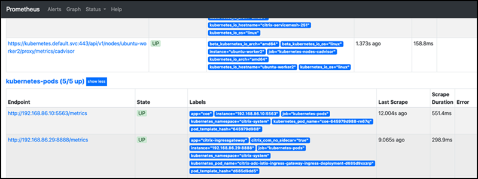

To get pod IP address of Citrix ADC Observability Exporter deployed in `citrix-system`, run the command `kubectl get pods -o wide -n citrix-system` in the Kubernetes cluster.

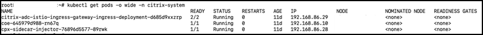

## Configuring the Dashboard in Grafana

1. Open **http://grafana.citrixservicemesh.com:3000** in browser.

2. On Grafana, click **Configuration**. 

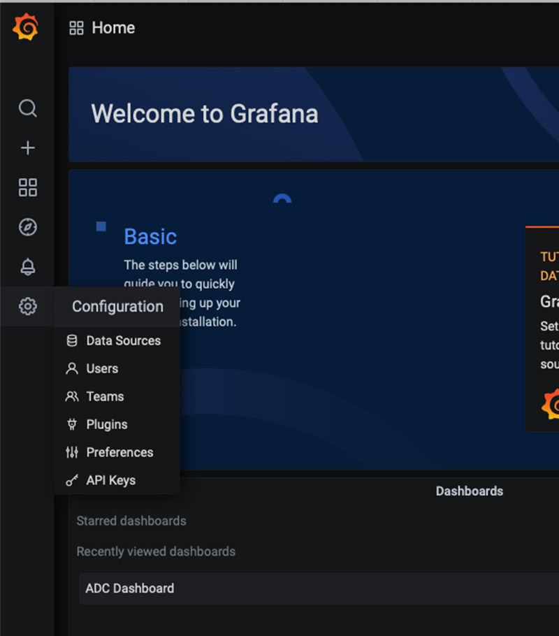

3. Click **Prometheus**.

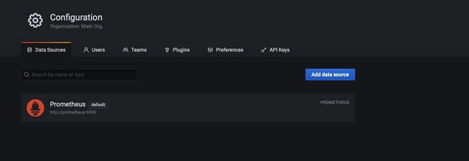

4. Modify the name as `Prometheus` and click **Save and Test**.

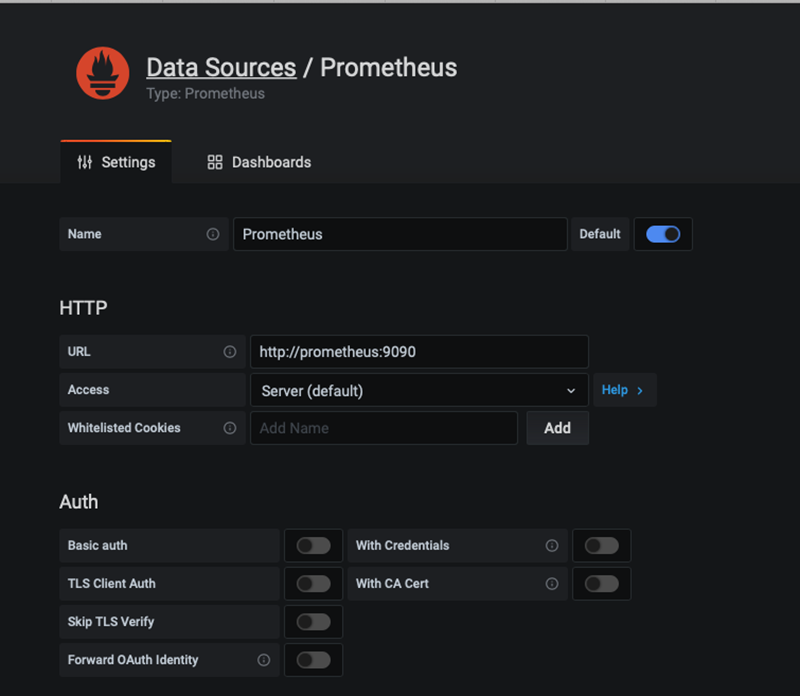

5. Open **[this](https://raw.githubusercontent.com/citrix/citrix-helm-charts/master/examples/servicemesh_with_coe_and_adm/manifest/dashboard.json)** in another tab and copy the JSON content.

6. Click **+** and select **Import**. 

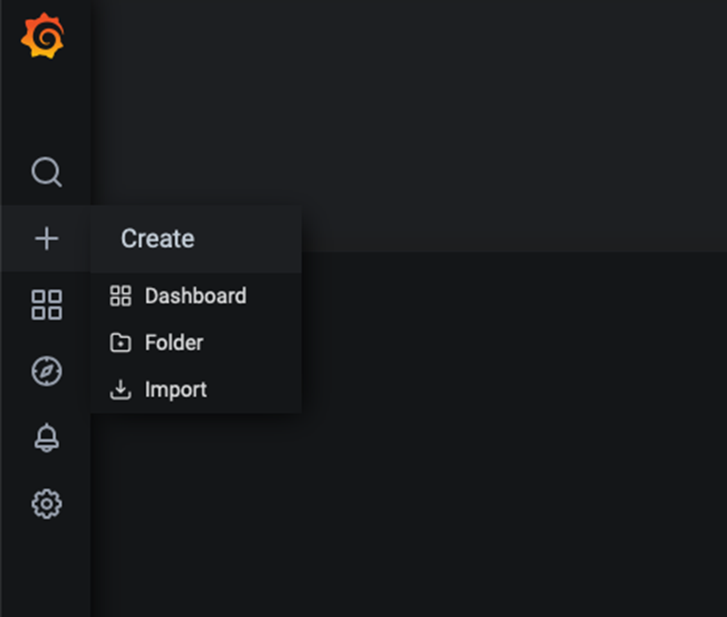

Paste the copied JSON content and click **Load**. 

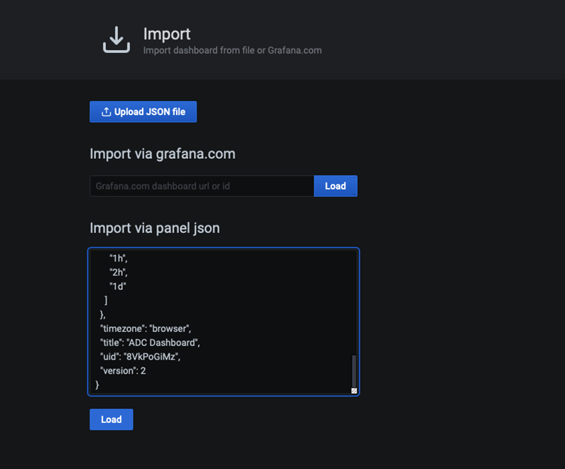

7. You can set a proper name for Dashboard and click **Import**.

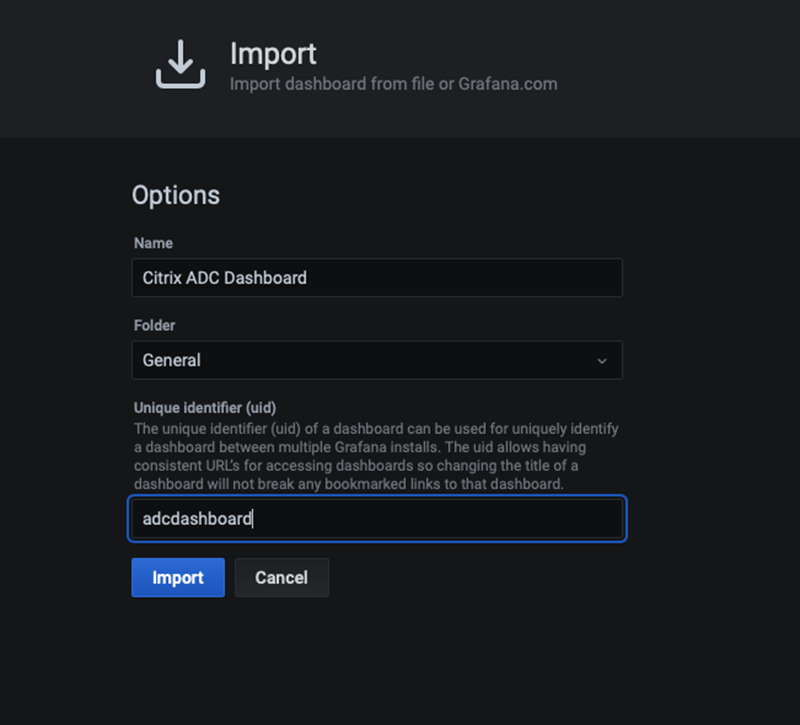

8. ADC dashboard displays the stats of the Ingress Gateway and Citrix ADC CPX sidecar proxies.

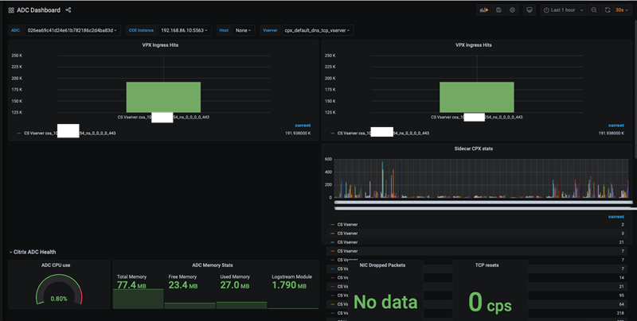

# <a name="servicegraph"> I) Visualize Service Graph in Citrix ADM</a>

Before visualizing the Service Graph, you can check if the virtual server configured in ADC are properly discovered and licensed. For this, see the section: [Debugging](#debugging).

In ADM navigate  `Application > Service Graph > MicroServices`.

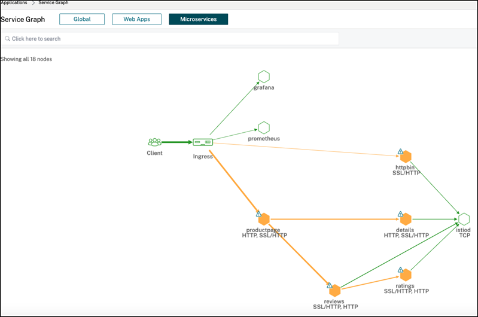

You can view **transation logs** in the service graph. Click any service and select **Transaction Logs**. 

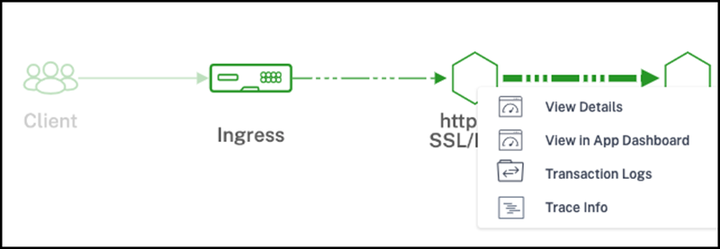

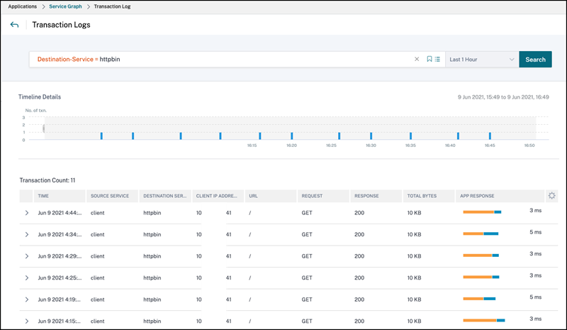

### Tracing

You can view **Tracing** from the service graph. Click any service and select **Trace Info**.

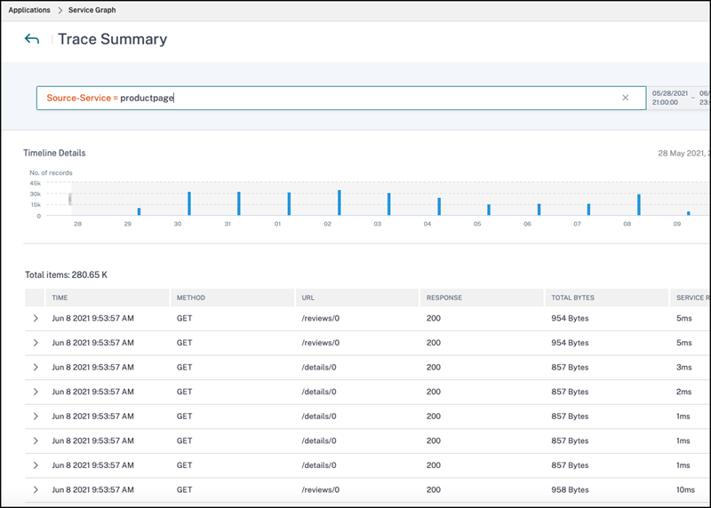

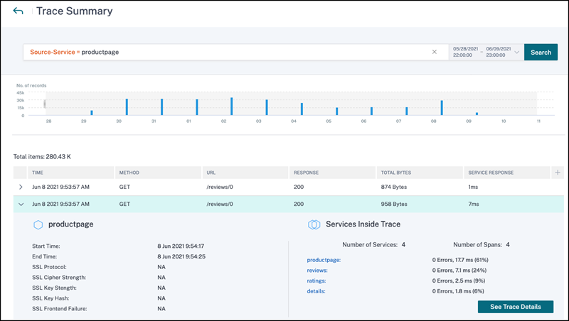

You can select **See Trace Details** to visualize the entire trace in the form of a chart of all transactions which are part of the trace.

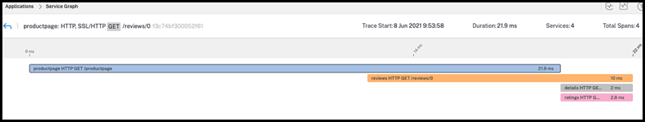

# <a name="cleanup">J) Clean Up </a>

      kubectl delete namespace bookinfo
      kubectl delete namespace httpbin 
      kubectl delete namespace citrix-system
      kubectl delete -f destinationrule_agent_coe.yaml

**Note:** You need to remove the cluster and agent from Citrix ADM UI manually.

# <a name="debugging">K) Debugging </a>

Service Graph will not be populated if virtual server configurations of Citrix ADC CPXs are not populated in ADM. Also, the virtual server in the ingress gateway ADC need to be licensed. Following sections provide information on licensing the virtual server in the ingress gateway Citrix ADC VPX and discovering the virtual server configuration on Citrix ADC CPX.

## Licensing virtual server of Ingress Gateway Citrix ADC VPX

1. Navigate to `Networks > Instances > Citrix ADC` and choose `VPX` in Citrix ADM.

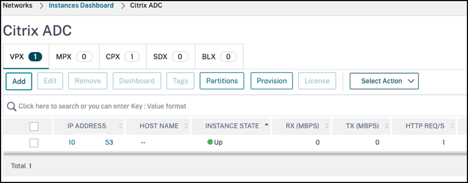

2. Select the `VPX IP` of your ingress gateway ADC and choose `Configure Analytics` under `Select Action`.

3. Virtual server configured on the VPX is listed.

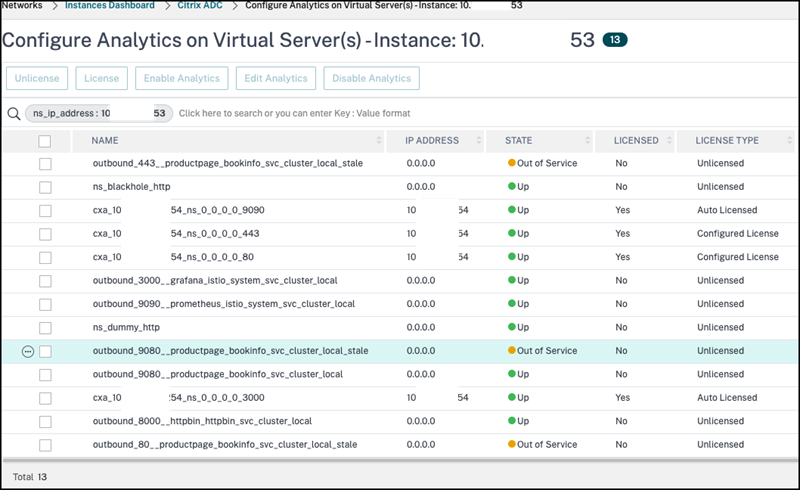

4. License all the virtual server whose IP address is VIP, if it is not licensed. To license, select the `vserver` and click `License`.

#### Discovering virtual server Configuration of Citrix ADC CPX

1. Navigate to `Networks > Instances > Citrix ADC` and choose a Citrix ADC CPX instance.

2. Select the Citrix ADC CPX instance from the list and choose `Configure Analytics` under `Select Action`.

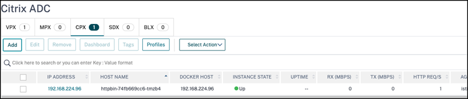
   
3. Citrix ADM polls the Citrix ADC CPX in the interval of 10 mins. If the page does not list virtual server, then you can manually poll the Citrix ADC CPX.

   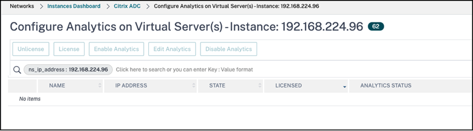

4. For manual Polling Citrix ADC CPX:

    a. Navigate to `Networks > Networking Functions` and click `Poll Now`.
   
    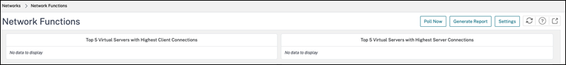

    b. Click `Select Instances`. A list of instances is displayed. 

    c. Choose the Citrix ADC CPX instance from the list.

    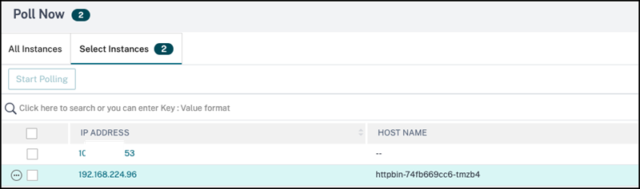

    d. Click `Start Polling`
    
    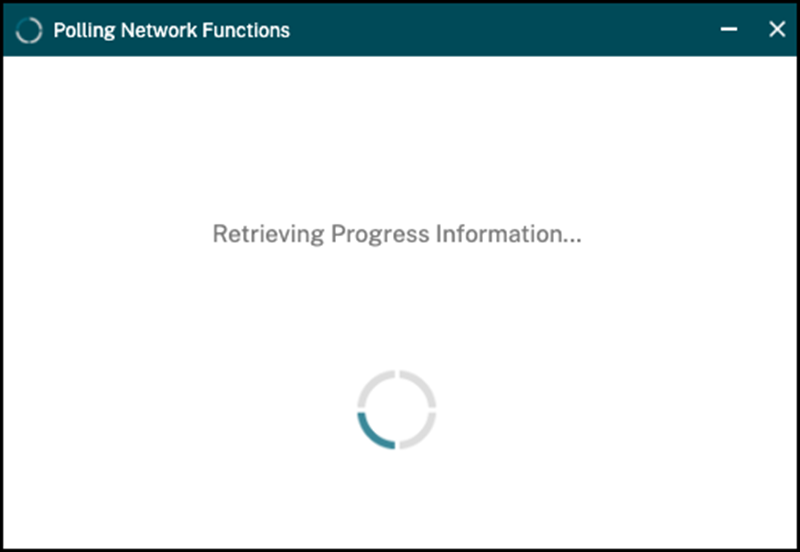

    e. Polling requires a couple of minutes to complete.

    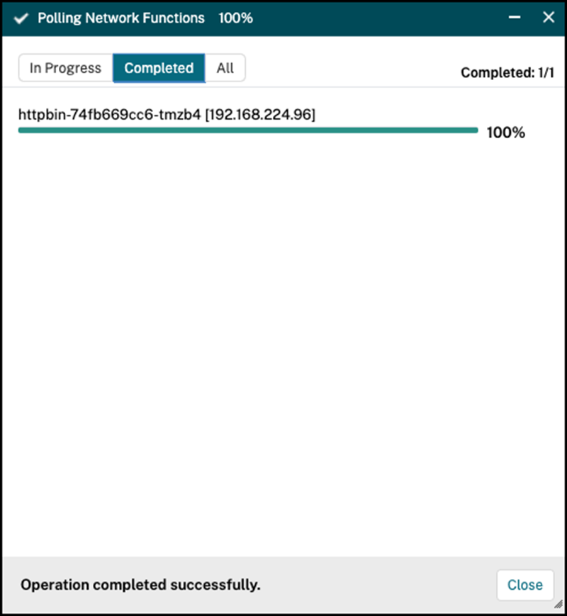

     Once polling is completed, navigate to `Networks > Instances > Citrix ADC` and choose Citrix ADC CPX instance. 
     
     Select the Citrix ADC CPX from the list and choose `Configure Analytics` under `Select Action`. 
     
     Now, the list of virtual server configured on Citrix ADC CPX is displayed.

    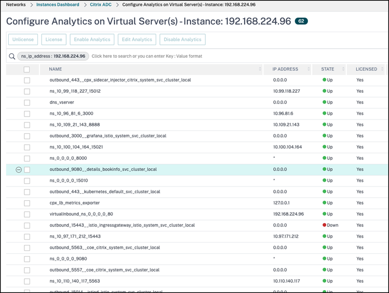

    You can now view the service graph by navigating to `Applications > Service Graph > Microservices ` in Citrix ADM.
